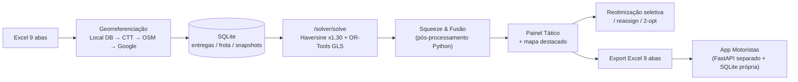

# 🔍 Análise do GeoRoutePlan — Estado Atual e Temas para Debate

> Base: `GeoRoutePlan.md` (documento mestre), código em `backend/`, `utils/`, `frontend/`, `motoristas_webapp/` e histórico git (últimos 25 commits).

---

## 1. Visão rápida da arquitetura

**Pontos fortes**
- Cascata de geocoding coerente com o princípio *Low-Cost* ([geocoder_engine.py](file:///c:/Users/paulo/.gemini/antigravity/playground/core-omega/PRJT_GEO/utils/geocoder_engine.py)) — pára logo que obtém nível ≤ 2.
- Solver OR-Tools completo: capacidade KG + m³, máx. paragens, janelas horárias em segundos, multi-armazém, regras via `VehicleVar().SetValues()`.
- Motor de regras simples e legível ([rules_engine.py](file:///c:/Users/paulo/.gemini/antigravity/playground/core-omega/PRJT_GEO/utils/rules_engine.py)).
- Ferramentas táticas ricas (reassign, bulk, reotimização seletiva, auditoria).

---

## 2. Como o solver decide hoje (o núcleo do planeamento)

| Aspeto | Implementação atual |
|---|---|
| Distância | Haversine (linha reta) × `ROAD_FACTOR = 1.30` |
| Tempo | Velocidade por comprimento do troço: >25 km → 80 km/h, >10 km → 65 km/h, resto ≥45 km/h |
| Objetivo | Minimizar **metros** + custo fixo de **500 000** por viatura usada (≈ 500 km "virtuais") |
| Fase 2 | *Squeeze*: tenta esvaziar as rotas mais pequenas inserindo as paragens noutras (aceita **qualquer** inserção viável, independentemente dos km acrescentados) |
| Fase 3 | Fusão de pares de rotas com ≤ 12 paragens + polimento 2-opt |

👉 Na prática o sistema está calibrado para **"usar o menor número possível de viaturas"**, e só depois pensa em km.

---

## 3. Lacunas e inconsistências encontradas

### 3.1 Campos do Excel que o solver ignora
| Campo (aba) | Situação |
|---|---|
| `Max_Entregas` (Frota) | [`extract_fleet_dict`](file:///c:/Users/paulo/.gemini/antigravity/playground/core-omega/PRJT_GEO/backend/api/solver.py#L223-L263) não o mapeia → **todas as viaturas ficam com 30** |
| `Velocidade_Media` (Frota) | O solver usa o modelo fixo; mas o recálculo de horários ([`recalculate_route_stops`](file:///c:/Users/paulo/.gemini/antigravity/playground/core-omega/PRJT_GEO/backend/api/solver.py#L307-L393)) usa a velocidade da viatura → **o plano e a timeline podem divergir** |
| `Custo_KM`, `Custo_Hora` (Frota) | Lidos mas **não entram na função objetivo** (todas as viaturas "custam" o mesmo) |
| `Hora_Abertura`, `Hora_Fecho`, `Tempo_Carga_Min` (Armazéns) | Não usados — a viatura parte exatamente à hora de início de turno |
| `Prioridade` (Entregas) | Lida e descartada (todas as entregas têm a mesma penalização de drop) |
| Balanceamento | O documento mestre diz que existe; no `/solve` **não existe** (só na reotimização seletiva, via limite de paragens) |

### 3.2 `/solve` vs `/reoptimize-selected-routes`
- `/solve` lê a frota da tabela **`frota`** (BD); a reotimização lê do **snapshot** → podem usar dados diferentes.
- A reotimização passa `rules_matrix=[]` ([linha 1851](file:///c:/Users/paulo/.gemini/antigravity/playground/core-omega/PRJT_GEO/backend/api/solver.py#L1851)) → as regras `PERMITIR` da aba 4 são ignoradas; entregas que dependam delas caem para "Por Distribuir".
- O parâmetro `objective` ("distance" | "group") é recebido mas não é usado.
- A reotimização lê as regras da coluna `regras` (minúsculas); vale a pena confirmar se o dataframe canónico usa `Regras`.

### 3.3 Modelo de velocidade triplicado
A mesma lógica (80/65/45) existe no solver, no `recalculate_route_stops` e provavelmente no auditor. Qualquer calibração tem de ser feita em 3 sítios.

### 3.4 Escalabilidade do *Squeeze*
Para cada paragem × cada rota × cada posição corre um 2-opt completo com verificação O(n) → cresce muito depressa. Com 300–500 entregas pode demorar mais do que o próprio OR-Tools.

### 3.5 Dados e operação
- **Três fontes de verdade**: tabela `entregas`, `snapshots.payload_json` (estado completo serializado a cada operação) e o Excel.
- **Dois sistemas de tracking**: `backend/api/tracking.py` e `motoristas_webapp/` (FastAPI separado, `daily_session.db` própria). No `docker-compose.yml` o `driver-app` **não tem volume** → perde os dados a cada redeploy.
- Monólitos: `solver.py` (1 929 linhas) e `tactical/page.tsx` (2 240 linhas).

> [!WARNING]
> **Ficheiros Excel de clientes reais estão versionados no git** (`Ficheiros EXCEL/PedroLopes`, `AUC`, `TNB`, ...). Se o repositório for público, ou vier a ser partilhado, há risco RGPD. (Os ficheiros de chaves `google_config.json` / `secrets.toml` estão bem excluídos.)

---

## 4. Ideias para debate

| # | Ideia | Custo | Impacto |
|---|---|:---:|:---:|
| A | **OSRM/Valhalla self-hosted** com o extrato OSM de Portugal (+ Espanha) para a matriz → distâncias e tempos **por estrada real**, a custo zero de API (respeita a regra de congelamento da Google Routes Matrix) | Servidor ~2 GB RAM | ⭐⭐⭐ |
| B | **Função objetivo por custo real**: arco = `€/km × km + €/h × tempo`, custo fixo por viatura parametrizável (em vez de 500 000 fixo) → o utilizador escolhe "menos viaturas" vs "menos km" vs "menos horas" | Baixo | ⭐⭐⭐ |
| C | Ligar os campos ignorados: `Max_Entregas`, velocidade, horário/tempo de carga do armazém, `Prioridade` (penalização de drop diferenciada) | Baixo | ⭐⭐⭐ |
| D | **Balanceamento real** no `/solve` (`SetGlobalSpanCostCoefficient` na dimensão Tempo ou limites suaves de paragens) | Baixo | ⭐⭐ |
| E | **Pausas do motorista** (intervalo de almoço / pausas legais) e **multi-viagem** (voltar ao armazém para recarregar) | Médio | ⭐⭐ |
| F | Segunda janela horária (`Janela2_Inicio/Fim`) — comum na distribuição alimentar/HoReCa | Médio (impacta as 9 abas) | ⭐⭐ |
| G | Trocar o *Squeeze* Python por mecanismos nativos do OR-Tools (custos fixos + mais tempo de GLS) ou limitar o seu raio de ação | Médio | ⭐⭐ |
| H | Centralizar o modelo de tempo/distância num único módulo `travel_model.py` | Baixo | ⭐⭐ |
| I | Unificar o tracking: a PWA passa a consumir o backend principal (uma BD, um tracking) | Médio-alto | ⭐⭐⭐ |
| J | Retirar Excel de clientes do git (+ limpar histórico) e mover para fixtures anonimizadas | Baixo | Risco legal |
